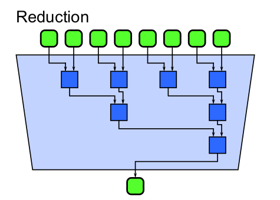
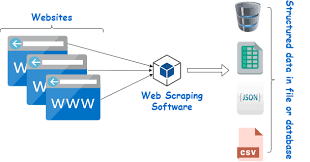
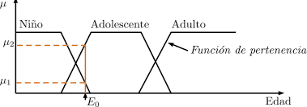
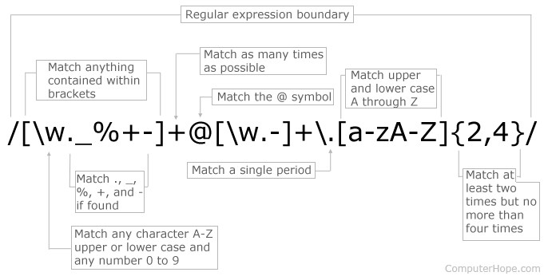
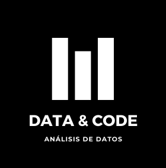

```{r setup, include=FALSE}
knitr::opts_chunk$set(echo = TRUE)
```
***
# Introducción
En estos proyectos usaremos diferentes herramientas y metodologías como: [programación funcional](https://www.ionos.mx/digitalguide/paginas-web/desarrollo-web/programacion-funcional/), 
[programacion paralela](https://www.teldat.com/blog/es/computacion-paralela-capacidad-procesamiento/), [web scrapping](https://aukera.es/blog/web-scraping/), [lógica difusa](https://www.sciencedirect.com/science/article/pii/S0186104217300955), [procesamiento del lenguaje natural](https://towardsdatascience.com/your-guide-to-natural-language-processing-nlp-48ea2511f6e1), [expresiones regulares](https://www.ionos.mx/digitalguide/paginas-web/creacion-de-paginas-web/regex/), y más....







Todo este documento, la app y demás materiales al igual que otros proyectos se encuentran disponibles para su consulta y descarga en [Data&Code.com](https://data-and-code.github.io) y de igual forma pueden checar la app del proyecto en [Shinyapps](https://ricardovargas.shinyapps.io/Archivos_en_PDF/).



***

# Proyecto 1

En este primer proyecto tenemos varios objetivos a cumplir, y estos son:

1. Extraer la información que se encuentre en la [primera base de datos](https://drive.google.com/drive/u/0/folders/1CUSIWYEE9MGIOuoFqAH3UBRIq_m-2b5D).
2. Crear una tabla con el número de palabras totales por ciclo.
3. Crear  una tabla con las 10 palabras con mayor frecuencia que coinciden por ciclo.
4. Crear una tabla con las palabras que son únicas en cada archivo.
5. Crear una tabla con la siguiente información: nombre de la asignatura, clave, ciclo, créditos.
6. Construir una salida, donde se pueda exportar la tabla del paso 5 en formatos: .csv, .xls, .doc, .txt y html.
7. Redactar conclusiones del trabajo realizado.

## Bibliotecas de R a usar
[Pacman](http://https://www.rdocumentation.org/packages/pacman/versions/0.5.1) envuelve convenientemente las funciones relacionadas con la biblioteca y el paquete y las nombra de una manera intuitiva y consistente.

~~Básicamente, nos permite instalar lo que nos hace falta de las librerías para su uso (incluso la propia librería) y llamarla al mismo tiempo.~~

```{r}
pacman::p_load(fs, magrittr, purrr, tibble, dplyr, stringr, quanteda, pdftools, DT, ggplot2, reshape2, plotly)
```

## 1. Extraer la información que se encuentre en la primera base de datos.
* Aquí lo que hacemos es :
  + Almacenar las rutas de los archivos PDFs (sus nombres).
  + Leer el contenido de los archivos PDFs y almacenarlos en una sola lista.
  + Extraer los nombres de los ciclos en orden.
  + Obtener una lista de listas con el contenido de los PDFs agrupados por ciclos.
    - Separar y agrupar los PDFs por ciclos.
    - Asignar el nombre de cada ciclo.
    - Renombrar los PDFs extrayendo solamente el nombre de la materia.
```{r}
pdf_filenames_1 <- dir_ls("../extdata/Temarios IDeIO finales/", recurse = TRUE, glob = "*.pdf")

pdf_files_1 <- pdf_filenames_1 %>%
  map(pdf_text) %>%
  map_chr(str_c, collapse = " ") %>%
  set_names(nm = pdf_filenames_1)

cycles <- names(pdf_files_1) %>%
  str_remove("^../") %>%
  str_split_fixed(pattern = "/", n = 4) %>%
  extract(, 3) %>%
  unique() %>%
  extract(c(2:4, 1))

syllabus <- cycles %>%
  map(~ keep(pdf_files_1, str_detect(names(pdf_files_1), pattern = .x))) %>%
  set_names(nm = cycles) %>%
  map_depth(1, ~ set_names(.x, str_extract(names(.x), pattern = "[A-Z]{2}[0-9]{3}.*(?=.pdf)")))
```

## Visualizamos el resultado 1
```{r}
ls.str(syllabus)
```

## 2. Crear una tabla con el número de palabras totales por ciclo.

* Aquí lo que hacemos es :
  + Importar al entorno los términos de parada (stop words) en español
  + Composición de funciones para obtener las palabras del texto
    - Convertir el texto a minúsculas
    - Dividir y extraer las subcadenas de texto que correspondan a palabras
    - Convertir el resultado a un vector de caracteres
    - Eliminar los términos de parada de las palabras
    - Eliminar los tokens que solo estn compuestos por un caracter
    - Ejecutar las funciones en el orden que fueron declaradas
  + Extraer todas las palabras por temario
  + Obtener el número de palabras totales por ciclo
    - Contar el número de palabras de cada temario
    - Obtener el número de palabras por ciclo
    - Convertir la lista a una tabla
```{r}
stop_words_es <- stopwords(language = "es")

get_words <- compose(
  str_to_lower,
  ~ tokens(.x, remove_punct = TRUE, remove_numbers = TRUE, remove_url = TRUE),
  as.character,
  ~ .x[!.x %in% stop_words_es],
  ~ .x[str_length(.x) > 1],
  .dir = "forward"
)

words_by_syllabus <- syllabus %>%
  map_depth(2, get_words)

num_words_by_cycle <- words_by_syllabus %>%
  map_depth(2, length) %>%
  map_depth(1, reduce, sum) %>%
  as_tibble()

num_words_by_cycle <<- data.frame(num_words_by_cycle)
num_words_by_cycle <<- melt(num_words_by_cycle,measure.vars = names(num_words_by_cycle)) 
colnames(num_words_by_cycle)<-c("ciclo","conteo")
num_words_by_cycle["ciclo"] <- c("Primero","Segundo","Tercero","Cuarto")
```

## Visualizamos el resultado 2
```{r}
c <- ggplot(data=num_words_by_cycle) + geom_bar(mapping = aes(x=ciclo, y=conteo, fill=ciclo), stat='identity')
fig <- ggplotly(c)
fig
```

## 3. Crear una tabla con las 10 palabras con mayor frecuencia que coinciden por ciclo.

```{r}
most_freq_by_cycle <- words_by_syllabus %>%
  map_depth(1, ~ reduce(.x, append)) %>%
  map(dfm) %>%
  map(textstat_frequency, n = 10) %>%
  map(as_tibble) %>%
  map(~ select(.x, Palabras = feature, Frecuencia = docfreq)) %>%
  map2(cycles, ~ add_column(.x, Ciclo = .y)) %>%
  reduce(bind_rows)
```

## Visualizar el resultado 3
```{r}
d <- ggplot(data=most_freq_by_cycle) + geom_bar(mapping = aes(x=Frecuencia, y=Palabras, fill=Ciclo), stat='identity')
fig_2 <- ggplotly(d)
fig_2
datatable(most_freq_by_cycle, filter = 'top')
```

## 4. Crear una tabla con las palabras que son únicas en cada archivo.

* Tener las palabras por temario eliminando la agrupación por ciclo
* Obtener las palabras que son únicas en cada archivo
  + Filtrar las palabras para que sean únicas
  + Agregar una columna con el nombre del ciclo
  + Convertir el resultado en una sola tabla
  + Renombrar la columna con las palabras
  
```{r}
words_by_syllabus_no_cycle <- words_by_syllabus %>%
  flatten()

uniq_words_by_syllabus <- words_by_syllabus_no_cycle %>%
  map2(names(words_by_syllabus_no_cycle), ~ .x[!.x %in% reduce(words_by_syllabus_no_cycle[names(words_by_syllabus_no_cycle) != .y], append)]) %>%
  map(unique) %>%
  map(as_tibble) %>%
  map2(names(words_by_syllabus_no_cycle), ~ add_column(.x, Archivo = .y)) %>%
  reduce(bind_rows) %>%
  rename(Palabras = value)
```

## Visualizamos el resultado 4

```{r}
datatable(uniq_words_by_syllabus, filter = 'top')
```

## 5. Crear una tabla con la siguiente información: nombre de la asignatura, clave, ciclo, créditos.

* Extraer la información con expresiones regulares
  + Reducir las dimensiones para eliminar la agrupación por ciclos
  + Convertir el resultado a una tabla
  
```{r}
subjects_info <-
  list(
    "Nombre de la asignatura" = map_depth(syllabus, 1, ~ str_trim(str_extract(names(.x), pattern = "(?<=[A-Z]{2}[0-9]{4}).*"))),
    "Clave" = map_depth(syllabus, 1, ~ str_extract(names(.x), pattern = "[A-Z]{2}[0-9]{4}")),
    "Ciclo" = map_depth(syllabus, 1, ~ str_extract(.x, pattern = "(?<=Área de formación curricular\r?\n\\s?)[1-4]-[1-4]")),
    "Créditos" = map_depth(syllabus, 1, ~ str_trim(str_extract(.x, pattern = "(?<=[A-Z]{2}[0-9]{4}\\s{2,10}).*(?=\\s{2,10}(Profesional Asociado|Licenciatura (Básica|Elección|Preespecialidad)))")))
  ) %>%
  map_depth(1, ~ reduce(.x, append)) %>%
  as_tibble()
```

## Visualizamos el resultado 5

```{r}
datatable(subjects_info, filter = 'top')
```

## 6. Construir una salida, donde se pueda exportar la tabla del paso 5 en formatos: .csv, .xls, .doc, .txt y html.
```{r}
subjects_info %>%
  DT::datatable(
    extensions = 'Buttons', 
    options = list(dom = 'Bfrtip', 
                   buttons = list('copy', 'print', list(
                   extend = 'collection',
                   buttons = c('csv', 'excel', 'pdf'),
                   text = 'Download'
               ))))
```

## 7. Redactar conclusiones del trabajo realizado.

Después de estar probando todas estas técnicas y herramientas para la extracción de datos que mencionamos en la introducción, podemos ver el potencial de poder trabajar con casi cualquier fuente de datos que tengamos **o no** disponibles. Además, en este ejercicio, leer los PDFs fue relativamente sencillo, pues solamente fue necesario extraer texto, y obtenerlo a partir de técnicas como las expresiones regulares.

Si bien aún nos quedan aspectos que pulir del lado de ETL como de visualización, iremos liberando las actualizaciones conforme logremos puntos importantes.

Cabe recalcar que aquí aprovechamos diversas técnicas y metodologías vistas a lo largo de la carrera y algunas otras que hemos aprendido por nuestra cuenta. Entre ellas: Programación funcional, Procesamiento del Lenguaje Natural, la visualización de datos en Shiny/RMarkdown y las Expresiones Regulares.

***

# Proyecto 2

En este segundo proyecto tenemos varios objetivos a cumplir, y estos son:

1. Extraer la información que se encuentre en la [segunda base de datos](https://app.schoology.com/link?path=https%3A%2F%2Fwww.gob.mx%2Fsalud%2Facciones-y-programas%2Fcoronavirus-covid-19-comunicados-tecnicos-diarios-historicos-2020). (Cada grupo debe trabajar un mes diferente). Los meses a trabajar son: mayo-diciembre del 2020.
2. Con la información proporcionada a nivel mundial, cree un tabla y muestre un gráfico que visualice la información mensual.
3. Con la información de defunciones positivas, cree un tabla y muestre un gráfico que visualice la información mensual.
4. Redactar conclusiones del trabajo realizado.

## Extraemos los datos

Este código no se ejecutará debido al alto costo computacional que implica. Por otro lado, ya están precargados los datos obtenidos por el código, y serán con los que trabajaremos.

De cualquier forma, el código se presenta a continuación para la comprensión del procedimiento.

```{r eval=FALSE}
# Extraccion del texto de los PDFs
pacman::p_load(fs, pdftools, tesseract, rvest, purrr, furrr, stringr)

# Definir el numero de workers que permitiran ejecutar funciones de purrr de forma paralela
plan(multisession, workers = 4)

# Obtener las direcciones de los PDFs diarios del mes (Septiembre)
pdf_urls <- read_html("https://www.gob.mx/salud/documentos/coronavirus-covid-19-comunicados-tecnicos-diarios-septiembre-2020") %>%
  # Obtener los nodos HTML que corresponden a la etiqueta "a"
  html_nodes(css = "a") %>%
  # Extraer de los nodos el valor dentro del atributo "href", el cual contiene URLs
  html_attr(name = "href") %>%
  # Descartar los valores NA's
  discard(is.na) %>%
  # Quedarse con las URLS que terminen con ".pdf"
  keep(str_detect, pattern = ".pdf$") %>%
  # Completar cada URL
  map_chr(~ str_c("https://www.gob.mx", .x))

# Extraer el texto de cada PDF utilizando distintos valores de dpi
pdf_files_1000 <- pdf_urls %>%
  # Usar Tesseract para detectar el texto dentro de cada PDF (incluso del texto dentro de las imagenes)
  future_map(pdf_ocr_text, pages = c(1, 5), language = "spa", dpi = 1000) %>%
  # Renombrar cada elemento del resultado con su nombre de archivo original
  set_names(nm = str_extract(pdf_urls, pattern = "(?<=/)Comunicado.*\\.pdf$")) %>%
  # Invertir el orden del resultado para que los documentos se ordenen por fecha de forma ascendente
  rev()

pdf_files_800 <- pdf_urls %>%
  # Usar Tesseract para detectar el texto dentro de cada PDF (incluso del texto dentro de las imagenes)
  future_map(pdf_ocr_text, pages = c(1, 5), language = "spa", dpi = 800) %>%
  # Renombrar cada elemento del resultado con su nombre de archivo original
  set_names(nm = str_extract(pdf_urls, pattern = "(?<=/)Comunicado.*\\.pdf$")) %>%
  # Invertir el orden del resultado para que los documentos se ordenen por fecha de forma ascendente
  rev()

pdf_files_750 <- pdf_urls %>%
  # Usar Tesseract para detectar el texto dentro de cada PDF (incluso del texto dentro de las imagenes)
  future_map(pdf_ocr_text, pages = c(1, 5), language = "spa", dpi = 750) %>%
  # Renombrar cada elemento del resultado con su nombre de archivo original
  set_names(nm = str_extract(pdf_urls, pattern = "(?<=/)Comunicado.*\\.pdf$")) %>%
  # Invertir el orden del resultado para que los documentos se ordenen por fecha de forma ascendente
  rev()

pdf_files_700 <- pdf_urls %>%
  # Usar Tesseract para detectar el texto dentro de cada PDF (incluso del texto dentro de las imagenes)
  future_map(pdf_ocr_text, pages = c(1, 5), language = "spa", dpi = 700) %>%
  # Renombrar cada elemento del resultado con su nombre de archivo original
  set_names(nm = str_extract(pdf_urls, pattern = "(?<=/)Comunicado.*\\.pdf$")) %>%
  # Invertir el orden del resultado para que los documentos se ordenen por fecha de forma ascendente
  rev()

pdf_files_650 <- pdf_urls %>%
  # Usar Tesseract para detectar el texto dentro de cada PDF (incluso del texto dentro de las imagenes)
  future_map(pdf_ocr_text, pages = c(1, 5), language = "spa", dpi = 650) %>%
  # Renombrar cada elemento del resultado con su nombre de archivo original
  set_names(nm = str_extract(pdf_urls, pattern = "(?<=/)Comunicado.*\\.pdf$")) %>%
  # Invertir el orden del resultado para que los documentos se ordenen por fecha de forma ascendente
  rev()

pdf_files_600 <- pdf_urls %>%
  # Usar Tesseract para detectar el texto dentro de cada PDF (incluso del texto dentro de las imagenes)
  future_map(pdf_ocr_text, pages = c(1, 5), language = "spa", dpi = 600) %>%
  # Renombrar cada elemento del resultado con su nombre de archivo original
  set_names(nm = str_extract(pdf_urls, pattern = "(?<=/)Comunicado.*\\.pdf$")) %>%
  # Invertir el orden del resultado para que los documentos se ordenen por fecha de forma ascendente
  rev()

pdf_files_550 <- pdf_urls %>%
  # Usar Tesseract para detectar el texto dentro de cada PDF (incluso del texto dentro de las imagenes)
  future_map(pdf_ocr_text, pages = c(1, 5), language = "spa", dpi = 550) %>%
  # Renombrar cada elemento del resultado con su nombre de archivo original
  set_names(nm = str_extract(pdf_urls, pattern = "(?<=/)Comunicado.*\\.pdf$")) %>%
  # Invertir el orden del resultado para que los documentos se ordenen por fecha de forma ascendente
  rev()

pdf_files_500 <- pdf_urls %>%
  # Usar Tesseract para detectar el texto dentro de cada PDF (incluso del texto dentro de las imagenes)
  future_map(pdf_ocr_text, pages = c(1, 5), language = "spa", dpi = 500) %>%
  # Renombrar cada elemento del resultado con su nombre de archivo original
  set_names(nm = str_extract(pdf_urls, pattern = "(?<=/)Comunicado.*\\.pdf$")) %>%
  # Invertir el orden del resultado para que los documentos se ordenen por fecha de forma ascendente
  rev()

# Almacenar los resultados en una sola lista
pdf_files_2 <- list(
  dpi_500 = pdf_files_500,
  dpi_550 = pdf_files_550,
  dpi_600 = pdf_files_600,
  dpi_650 = pdf_files_650,
  dpi_700 = pdf_files_700,
  dpi_750 = pdf_files_750,
  dpi_800 = pdf_files_800,
  dpi_1000 = pdf_files_1000
)

# Se almacena el resultado en un archivo RData para usarlo el resto del proyecto
save(pdf_files_2, file = "../extdata/base_de_datos_2_raw.RData")
```

## 2. Con la información proporcionada a nivel mundial, cree un tabla y muestre un gráfico que visualice la información mensual.

Con la información obtenida, se lleva a cabo el proceso de limpieza.

```{r}
pacman::p_load(purrr, stringr, dplyr, tidyr, ggplot2, lubridate)

# Importar al entorno el texto de los PDFs diarios (obtenidos previamente mediante web scraping)
load("../extdata/base_de_datos_2_raw.RData")

# 2. Con la información proporcionada a nivel mundial, cree un tabla y muestre un gráfico que visualice la información mensual.

# Extraer el texto del que se obtiene la informacion por regiones de la OMS
regions_info <- map_depth(pdf_files_2, 2, pluck, 1)

# Extraer los datos de cada continente

# America
america <-
  # Extraer el numero de acuerdo con la secuencia de valores detectada al principio y final del mes
  map(regions_info, str_extract_all, pattern = "1[3-6],([:digit:]{3},?){2}") %>%
  # Eliminar los numeros que no corresponden a posibles resultados
  map_depth(2, str_subset, pattern = "0{3}", negate = TRUE) %>%
  # Poner los resultados en un solo arreglo por dia
  transpose() %>%
  map_depth(1, flatten_chr) %>%
  # Eliminar los numeros repetidos
  map(unique) %>%
  # Elegir manualmente ciertos numeros
  map_if(~ length(.x) == 2, pluck, 1) %>%
  # Completar manualmente los numero faltantes
  map_at(24, ~ "15,872,421") %>%
  # Convertir la lista en un arreglo numerico
  flatten_chr() %>%
  str_remove_all(pattern = ",") %>%
  as.integer()

# Europa
europe <-
  # Extraer el numero de acuerdo con la secuencia de valores detectada al principio y final del mes
  map(regions_info, str_extract_all, pattern = "(?<=\\n|\\s)[4-5],([:digit:]{3},?){2}") %>%
  # Eliminar los numeros que no corresponden a posibles resultados
  map_depth(2, str_subset, pattern = "0{3}", negate = TRUE) %>%
  # Poner los resultados en un solo arreglo por dia
  transpose() %>%
  map_depth(1, flatten_chr) %>%
  # Eliminar los numeros repetidos
  map(unique) %>%
  # Elegir manualmente ciertos numeros
  map_at(c(1, 7), pluck, 1) %>%
  map_if(~ length(.x) > 1, pluck, 2) %>%
  # Corregir manualmente ciertos numeros
  map_at(9, ~ "4,600,967") %>%
  # Convertir la lista en un arreglo numerico
  flatten_chr() %>%
  str_remove_all(pattern = ",") %>%
  as.integer()

# Asia Sudoriental
southeastern_asia <-
  # Extraer el numero de acuerdo con la secuencia de valores detectada al principio y final del mes
  map(regions_info, str_extract_all, pattern = "(?<=\\s)[4-6],([:digit:]{3},?){2}") %>%
  # Eliminar los numeros que no corresponden a posibles resultados
  map_depth(2, str_subset, pattern = "0{3}", negate = TRUE) %>%
  # Poner los resultados en un solo arreglo por dia
  transpose() %>%
  map_depth(1, flatten_chr) %>%
  # Eliminar los numeros repetidos
  map(unique) %>%
  # Elegir manualmente ciertos numeros
  map_at(7, pluck, 2) %>%
  map_if(~ length(.x) > 1, pluck, 1) %>%
  # Corregir manualmente ciertos numeros
  map_at(24, ~ "6,436,394") %>%
  map_at(28, ~ "6,810,494") %>%
  # Convertir la lista en un arreglo numerico
  flatten_chr() %>%
  str_remove_all(pattern = ",") %>%
  as.integer()

# África
africa <-
  # Extraer el numero de acuerdo con la secuencia de valores detectada al principio y final del mes
  map(regions_info, str_extract_all, pattern = "(?<=\\n)1,([:digit:]{3},?){2}") %>%
  # Eliminar los numeros que no corresponden a posibles resultados
  map_depth(2, str_subset, pattern = "0{3}", negate = TRUE) %>%
  # Poner los resultados en un solo arreglo por dia
  transpose() %>%
  map_depth(1, flatten_chr) %>%
  # Eliminar los numeros repetidos
  map(unique) %>%
  # Elegir manualmente ciertos numeros
  map_at(c(2, 4, 23), pluck, 1) %>%
  map_at(5:6, pluck, 2) %>%
  # Convertir la lista en un arreglo numerico
  flatten_chr() %>%
  str_remove_all(pattern = ",") %>%
  as.integer()

# Mediterráneo Oriental
eastern_mediterranean <-
  # Extraer el numero de acuerdo con la secuencia de valores detectada al principio y final del mes
  map(regions_info, str_extract_all, pattern = "[1-2],([:digit:]{3},?){2}") %>%
  # Eliminar los numeros que no corresponden a posibles resultados
  map_depth(2, str_subset, pattern = "0{3}", negate = TRUE) %>%
  # Poner los resultados en un solo arreglo por dia
  transpose() %>%
  map_depth(1, flatten_chr) %>%
  # Eliminar los numeros repetidos
  map(unique) %>%
  # Elegir manualmente ciertos numeros
  map_at(c(1:2, 17, 18, 28), pluck, 1) %>%
  map_at(c(22:27, 30), pluck, 2) %>%
  map_at(3, pluck, 3) %>%
  map_if(~ length(.x) == 2, pluck, 1) %>%
  # Convertir la lista en un arreglo numerico
  flatten_chr() %>%
  str_remove_all(pattern = ",") %>%
  as.integer()

# Pacífico Occidental
western_pacific <-
  # Extraer el numero de acuerdo con la secuencia de valores detectada al principio y final del mes
  map(regions_info, str_extract_all, pattern = "(?<=\\n)[4-6][:digit:]{2},[:digit:]{3}") %>%
  # Eliminar los numeros que no corresponden a posibles resultados
  map_depth(2, str_subset, pattern = "0{3}", negate = TRUE) %>%
  # Poner los resultados en un solo arreglo por dia
  transpose() %>%
  map_depth(1, flatten_chr) %>%
  # Eliminar los numeros repetidos
  map(unique) %>%
  # Elegir manualmente ciertos numeros
  map_if(~ length(.x) == 2, pluck, 1) %>%
  # Completar manualmente los numero faltantes
  map_at(3, ~ "505,156") %>%
  map_at(11, ~ "535,413") %>%
  map_at(14, ~ "550,664") %>%
  map_at(16, ~ "560,287") %>%
  map_at(19, ~ "573,120") %>%
  map_at(20, ~ "577,905") %>%
  map_at(26, ~ "598,060") %>%
  map_at(27, ~ "600,891") %>%
  # Convertir la lista en un arreglo numerico
  flatten_chr() %>%
  str_remove_all(pattern = ",") %>%
  as.integer()

# Almacenar los resultados en una tabla
worldwide_info <- as_tibble(
  list(
    "Días" = seq(from = ymd('2020-09-01'), to = ymd('2020-09-30'), by = 'days'),
    "América" = america,
    "Asia Sudoriental" = southeastern_asia,
    "Europa" = europe,
    "Mediterráneo Oriental" = eastern_mediterranean,
    "África" = africa,
    "Pacífico Occidental" = western_pacific
  )
)

datatable(worldwide_info)
```

## La gráfica correspondiente es la siguiente:

```{r}
# Crear grafico para visualizar la información mensual
worldwide_info %>%
  pivot_longer(-1, names_to = "Regiones de la OMS", values_to = "cases") %>%
  ggplot(aes(x = `Días`, y = cases, color = `Regiones de la OMS`)) %>%  +
    geom_line() +
    scale_colour_manual(values = c("green", "red2", "purple", "blue2", "green4", "yellow3")) +
    labs(y = "Número de casos", title = "Casos acumulados de COVID-19 por SARS-CoV-2 por regiones de la OMS\n(Septiembre 2020)")
  ggplotly()
```


## 3. Con la información de defunciones positivas, cree un tabla y muestre un gráfico que visualice la información mensual.

La extracción de la información de los estados se lleva a cabo en las siguientes líneas de código.

Algunos estados se pudieron obtener; algunos otros no.

```{r}
# Extraer el texto del que se obtiene la informacion por entidad federativa
entities_info <- map_depth(pdf_files_2, 2, pluck, 2) %>%
  map(str_extract_all, pattern = "([:alpha:]+\\s){1,3}\\| [:digit:]+")

## Estados terminados ##

## Chihuahua, Chiapas, Campeche y Michoacan ##
ch <- entities_info %>%
  # Elegir los valores que contengan "CH"
  map_depth(2, str_subset, pattern = "[C|c][H|h]") %>%
  # Poner los resultados en un solo arreglo por dia
  transpose() %>%
  map_depth(1, flatten_chr) %>%
  # Eliminar los valores repetidos
  map(unique)

# Chihuahua
chihuahua <- ch %>%
  # Aproximar la busqueda de texto usando logica difusa (Usando la distancia de edicion de Levenshtein)
  map_depth(2, agrep, pattern = "CHIHU", value = TRUE) %>%
  # Poner los resultados en un solo arreglo por dia
  map_depth(1, flatten_chr) %>%
  # Extraer los numeros de 4 digitos de las cadenas
  map_depth(1, str_extract_all, pattern = "[:digit:]{4}") %>%
  # Poner los resultados en un solo arreglo por dia
  map_depth(1, flatten_chr) %>%
  # Eliminar los resultados repetido
  map(unique) %>%
  # Elegir manualmente ciertos numeros
  map_at(c(21, 25), pluck, 1) %>%
  # Completar manualmente ciertos numeros
  map_at(1, ~ "1147") %>%
  map_at(2, ~ "1159") %>%
  map_at(3, ~ "1169") %>%
  map_at(4, ~ "1177") %>%
  map_at(5, ~ "1187") %>%
  map_at(6, ~ "1198") %>%
  map_at(8, ~ "1211") %>%
  map_at(11, ~ "1233") %>%
  map_at(13, ~ "1240") %>%
  map_at(14, ~ "1241") %>%
  map_at(17, ~ "1258") %>%
  map_at(22, ~ "1291") %>%
  map_at(29, ~ "1371") %>%
  map_at(30, ~ "1382") %>%
  # Corregir manualmente ciertos numeros
  map_at(24, ~ "1318") %>%
  map_at(25, ~ "1336") %>%
  # Convertir la lista en un arreglo numerico
  flatten_chr() %>%
  str_remove_all(pattern = ",") %>%
  as.integer()

# Chiapas
chiapas <- ch %>%
  # Aproximar la busqueda de texto usando logica difusa (Usando la distancia de edicion de Levenshtein)
  map_depth(2, agrep, pattern = "CHIAPAS", value = TRUE) %>%
  # Poner los resultados en un solo arreglo por dia
  map_depth(1, flatten_chr) %>%
  # Extraer los numeros de las cadenas
  map_depth(1, str_extract_all, pattern = "[:digit:]+") %>%
  # Poner los resultados en un solo arreglo por dia
  map_depth(1, flatten_chr) %>%
  # Eliminar los resultados repetido
  map(unique) %>%
  # Elegir manualmente ciertos numeros
  map_at(3, pluck, 1) %>%
  map_at(c(21, 23, 25), pluck, 2) %>%
  map_at(c(22, 24), pluck, 3) %>%
  # Completar manualmente ciertos numeros
  map_at(1, ~ "1002") %>%
  map_at(c(5, 8, 9, 11), ~ "1009") %>%
  map_at(16, ~ "1016") %>%
  map_at(26, ~ "1018") %>%
  map_at(27, ~ "1019") %>%
  map_at(29:30, ~ "1020") %>%
  # Corregir manualmente ciertos numeros
  map_at(19:20, ~ "1016") %>%
  # Convertir la lista en un arreglo numerico
  flatten_chr() %>%
  str_remove_all(pattern = ",") %>%
  as.integer()

# Michoacan
michoacan <- ch %>%
  # Aproximar la busqueda de texto usando logica difusa (Usando la distancia de edicion de Levenshtein)
  map_depth(2, agrep, pattern = "MICH", value = TRUE) %>%
  # Poner los resultados en un solo arreglo por dia
  map_depth(1, flatten_chr) %>%
  # Extraer los numeros de 4 digitos de las cadenas
  map_depth(1, str_extract_all, pattern = "[:digit:]{4}") %>%
  # Poner los resultados en un solo arreglo por dia
  map_depth(1, flatten_chr) %>%
  # Eliminar los resultados repetido
  map(unique) %>%
  # Elegir manualmente ciertos numeros
  map_at(24:25, pluck, 1) %>%
  # Completar manualmente ciertos numeros
  map_at(1, ~ "1187") %>%
  map_at(2, ~ "1227") %>%
  map_at(4, ~ "1259") %>%
  map_at(5, ~ "1277") %>%
  map_at(6, ~ "1281") %>%
  map_at(7, ~ "1288") %>%
  map_at(8, ~ "1303") %>%
  map_at(9, ~ "1328") %>%
  map_at(12, ~ "1380") %>%
  map_at(14, ~ "1399") %>%
  map_at(17, ~ "1452") %>%
  map_at(18, ~ "1468") %>%
  map_at(19, ~ "1480") %>%
  map_at(21, ~ "1489") %>%
  map_at(22, ~ "1517") %>%
  map_at(27, ~ "1588") %>%
  # Corregir manualmente ciertos numeros
  map_at(10, ~ "1345") %>%
  map_at(16, ~ "1441") %>%
  # Convertir la lista en un arreglo numerico
  flatten_chr() %>%
  str_remove_all(pattern = ",") %>%
  as.integer()

## Sonora, Sinaloa y San Luis Potosi ##
sn <- entities_info %>%
  # Elegir los valores que comiencen con "S"
  map_depth(2, str_subset, pattern = "^[S|s]") %>%
  # Poner los resultados en un solo arreglo por dia
  transpose() %>%
  map_depth(1, flatten_chr) %>%
  # Eliminar los valores repetidos
  map(unique)

# Sonora
sonora <- sn %>%
  # Aproximar la busqueda de texto usando logica difusa (Usando la distancia de edicion de Levenshtein)
  map_depth(2, agrep, pattern = "SONO", value = TRUE) %>%
  # Poner los resultados en un solo arreglo por dia
  map_depth(1, flatten_chr) %>%
  # Extraer los numeros de 4 digitos de las cadenas
  map_depth(1, str_extract_all, pattern = "[:digit:]{4}") %>%
  # Poner los resultados en un solo arreglo por dia
  map_depth(1, flatten_chr) %>%
  # Eliminar los resultados repetido
  map(unique) %>%
  # Elegir manualmente ciertos numeros
  map_at(2, pluck, 1) %>%
  map_at(7, pluck, 2) %>%
  # Completar manualmente ciertos numeros
  map_at(5, ~ "1277") %>%
  map_at(9, ~ "2771") %>%
  map_at(11, ~ "2794") %>%
  map_at(13, ~ "2804") %>%
  map_at(14, ~ "2806") %>%
  map_at(17, ~ "2814") %>%
  map_at(23, ~ "2868") %>%
  map_at(25, ~ "2879") %>%
  map_at(26, ~ "2883") %>%
  map_at(27, ~ "2884") %>%
  map_at(28, ~ "2886") %>%
  map_at(29, ~ "2897") %>%
  map_at(30, ~ "2899") %>%
  # Corregir manualmente ciertos numeros
  map_at(5, ~ "2693") %>%
  # Convertir la lista en un arreglo numerico
  flatten_chr() %>%
  str_remove_all(pattern = ",") %>%
  as.integer()

# Sinaloa
sinaloa <- sn %>%
  # Aproximar la busqueda de texto usando logica difusa (Usando la distancia de edicion de Levenshtein)
  map_depth(2, agrep, pattern = "SINA", value = TRUE) %>%
  # Poner los resultados en un solo arreglo por dia
  map_depth(1, flatten_chr) %>%
  # Extraer los numeros de 4 digitos de las cadenas
  map_depth(1, str_extract_all, pattern = "[:digit:]{4}") %>%
  # Poner los resultados en un solo arreglo por dia
  map_depth(1, flatten_chr) %>%
  # Eliminar los resultados repetido
  map(unique) %>%
  # Elegir manualmente ciertos numeros
  map_at(c(3:4, 11, 13), pluck, 1) %>%
  # Completar manualmente ciertos numeros
  map_at(5, ~ "2868") %>%
  map_at(7, ~ "2879") %>%
  map_at(9, ~ "2914") %>%
  map_at(10, ~ "2949") %>%
  map_at(15, ~ "2993") %>%
  map_at(17, ~ "3004") %>%
  map_at(25, ~ "3119") %>%
  map_at(26, ~ "3128") %>%
  map_at(27, ~ "3142") %>%
  map_at(28, ~ "3150") %>%
  # Corregir manualmente ciertos numeros
  map_at(12, ~ "2969") %>%
  map_at(20, ~ "3052") %>%
  # Convertir la lista en un arreglo numerico
  flatten_chr() %>%
  str_remove_all(pattern = ",") %>%
  as.integer()

# San Luis Potosi
san_luis_potosi <- sn %>%
  # Aproximar la busqueda de texto usando logica difusa (Usando la distancia de edicion de Levenshtein)
  map_depth(2, agrep, pattern = "SANL", value = TRUE) %>%
  # Poner los resultados en un solo arreglo por dia
  map_depth(1, flatten_chr) %>%
  # Extraer los numeros de 4 digitos de las cadenas
  map_depth(1, str_extract_all, pattern = "[:digit:]{4}") %>%
  # Poner los resultados en un solo arreglo por dia
  map_depth(1, flatten_chr) %>%
  # Eliminar los resultados repetido
  map(unique) %>%
  # Completar manualmente ciertos numeros
  map_at(1, ~ "1190") %>%
  map_at(2, ~ "1211") %>%
  map_at(4, ~ "1243") %>%
  map_at(6, ~ "1297") %>%
  map_at(7, ~ "1298") %>%
  map_at(8, ~ "1319") %>%
  map_at(9, ~ "1355") %>%
  map_at(12, ~ "1421") %>%
  map_at(13, ~ "1427") %>%
  map_at(14, ~ "1431") %>%
  map_at(16, ~ "1457") %>%
  map_at(17, ~ "1463") %>%
  map_at(21, ~ "1542") %>%
  map_at(24, ~ "1624") %>%
  map_at(29, ~ "1681") %>%
  # Convertir la lista en un arreglo numerico
  flatten_chr() %>%
  str_remove_all(pattern = ",") %>%
  as.integer()

## Ciudad de Mexico y Estado de Mexico ##
mex <- entities_info %>%
  # Aproximar la busqueda de texto usando logica difusa (Usando la distancia de edicion de Levenshtein)
  map_depth(2, agrep, pattern = "MEXICO", value = TRUE) %>%
  # Poner los resultados en un solo arreglo por dia
  transpose() %>%
  map_depth(1, flatten_chr) %>%
  # Eliminar los valores repetidos
  map(unique)

# Ciudad de Mexico
ciudad_de_mexico <- mex %>%
  # Elegir los valores que comiencen con "C"
  map_depth(2, str_subset, pattern = "^C") %>%
  # Poner los resultados en un solo arreglo por dia
  map_depth(1, flatten_chr) %>%
  # Extraer los numeros de 5 digitos de las cadenas
  map_depth(1, str_extract_all, pattern = "[:digit:]{5}") %>%
  # Poner los resultados en un solo arreglo por dia
  map_depth(1, flatten_chr) %>%
  # Eliminar los resultados repetido
  map(unique) %>%
  # Completar manualmente ciertos numeros
  map_at(4, ~ "10780") %>%
  map_at(6, ~ "10869") %>%
  map_at(7, ~ "10900") %>%
  map_at(8, ~ "10986") %>%
  map_at(9, ~ "11043") %>%
  map_at(10, ~ "11103") %>%
  map_at(11, ~ "11146") %>%
  map_at(12, ~ "11199") %>%
  map_at(13, ~ "11224") %>%
  map_at(15, ~ "11318") %>%
  map_at(16, ~ "11351") %>%
  map_at(17, ~ "11403") %>%
  map_at(18, ~ "11491") %>%
  map_at(19, ~ "11545") %>%
  map_at(20, ~ "11571") %>%
  map_at(24, ~ "11814") %>%
  map_at(25, ~ "11894") %>%
  map_at(26, ~ "11926") %>%
  map_at(27, ~ "11962") %>%
  map_at(28, ~ "11996") %>%
  # Convertir la lista en un arreglo numerico
  flatten_chr() %>%
  str_remove_all(pattern = ",") %>%
  as.integer()

## Baja California y Baja California Sur ##
bc <- entities_info %>%
  # Aproximar la busqueda de texto usando logica difusa (Usando la distancia de edicion de Levenshtein)
  map_depth(2, agrep, pattern = "CALIFORNIA", value = TRUE) %>%
  # Poner los resultados en un solo arreglo por dia
  transpose() %>%
  map_depth(1, flatten_chr) %>%
  # Eliminar los valores repetidos
  map(unique)

# Baja California
baja_california <- bc %>%
  # Elegir las
  map_depth(2, str_subset, pattern = "[S|s][U|u][R|r]", negate = TRUE) %>%
  # Poner los resultados en un solo arreglo por dia
  map_depth(1, flatten_chr) %>%
  # Extraer los numeros de 4 digitos de las cadenas
  map_depth(1, str_extract_all, pattern = "[:digit:]{4}") %>%
  # Poner los resultados en un solo arreglo por dia
  map_depth(1, flatten_chr) %>%
  # Eliminar los resultados repetido
  map(unique) %>%
  # Elegir manualmente ciertos numeros
  map_at(12, pluck, 1) %>%
  # Completar manualmente ciertos numeros
  map_at(2, ~ "3174") %>%
  map_at(5, ~ "3223") %>%
  map_at(8, ~ "3249") %>%
  map_at(17, ~ "3334") %>%
  map_at(20, ~ "3374") %>%
  map_at(22, ~ "3411") %>%
  map_at(23, ~ "3434") %>%
  map_at(24, ~ "3450") %>%
  map_at(26, ~ "3478") %>%
  # Convertir la lista en un arreglo numerico
  flatten_chr() %>%
  str_remove_all(pattern = ",") %>%
  as.integer()
```

```{r}
## Estados no terminados ##

## Quintana Roo y Queretaro ##
qr <- entities_info %>%
  # Elegir los valores que comiencen con "QU"
  map_depth(2, str_subset, pattern = "^[Q|q][U|u]") %>%
  # Poner los resultados en un solo arreglo por dia
  transpose() %>%
  map_depth(1, flatten_chr) %>%
  # Eliminar los valores repetidos
  map(unique)

## Tabasco y Tamaulipas ##
ta <- entities_info %>%
  # Elegir los valores que comiencen con "TA"
  map_depth(2, str_subset, pattern = "^[T|t][A|a]") %>%
  # Poner los resultados en un solo arreglo por dia
  transpose() %>%
  map_depth(1, flatten_chr) %>%
  # Eliminar los valores repetidos
  map(unique)

## Guanajuato y Guerrero ##
gu <- entities_info %>%
  # Elegir los valores que comiencen con "GU"
  map_depth(2, str_subset, pattern = "^[G|g][U|u]") %>%
  # Poner los resultados en un solo arreglo por dia
  transpose() %>%
  map_depth(1, flatten_chr) %>%
  # Eliminar los valores repetidos
  map(unique)

## Colima y Coahuila ##
co <- entities_info %>%
  # Elegir los valores que comiencen con "CO"
  map_depth(2, str_subset, pattern = "^[C|c][O|o]") %>%
  # Poner los resultados en un solo arreglo por dia
  transpose() %>%
  map_depth(1, flatten_chr) %>%
  # Eliminar los valores repetidos
  map(unique)

## Tlaxcala y Oaxaca ##
xla <- entities_info %>%
  # Elegir los valores que contengan "XA o XC"
  map_depth(2, str_subset, pattern = "[X|x]([A|a]|[C|c])") %>%
  # Poner los resultados en un solo arreglo por dia
  transpose() %>%
  map_depth(1, flatten_chr) %>%
  # Eliminar los valores repetidos
  map(unique)

# Veracruz
ver <- entities_info %>%
  # Aproximar la busqueda de texto usando logica difusa (Usando la distancia de edicion de Levenshtein)
  map_depth(2, agrep, pattern = "VERACRUZ", value = TRUE) %>%
  # Poner los resultados en un solo arreglo por dia
  transpose() %>%
  map_depth(1, flatten_chr) %>%
  # Eliminar los valores repetidos
  map(unique)

# Puebla
pue <- entities_info %>%
  # Aproximar la busqueda de texto usando logica difusa (Usando la distancia de edicion de Levenshtein)
  map_depth(2, agrep, pattern = "PUEBLA", value = TRUE) %>%
  # Poner los resultados en un solo arreglo por dia
  transpose() %>%
  map_depth(1, flatten_chr) %>%
  # Eliminar los valores repetidos
  map(unique)

# Jalisco
ja <- entities_info %>%
  # Aproximar la busqueda de texto usando logica difusa (Usando la distancia de edicion de Levenshtein)
  map_depth(2, agrep, pattern = "JALISCO", value = TRUE) %>%
  # Poner los resultados en un solo arreglo por dia
  transpose() %>%
  map_depth(1, flatten_chr) %>%
  # Eliminar los valores repetidos
  map(unique)

# Nuevo Leon
nl <- entities_info %>%
  # Aproximar la busqueda de texto usando logica difusa (Usando la distancia de edicion de Levenshtein)
  map_depth(2, agrep, pattern = "LEON", value = TRUE) %>%
  # Poner los resultados en un solo arreglo por dia
  transpose() %>%
  map_depth(1, flatten_chr) %>%
  # Eliminar los valores repetidos
  map(unique)

# Hidalgo
hi <- entities_info %>%
  # Elegir los valores que comiencen con "H"
  map_depth(2, str_subset, pattern = "^[H|h]") %>%
  # Poner los resultados en un solo arreglo por dia
  transpose() %>%
  map_depth(1, flatten_chr) %>%
  # Eliminar los valores repetidos
  map(unique)

# Yucatan
yu <- entities_info %>%
  # Aproximar la busqueda de texto usando logica difusa (Usando la distancia de edicion de Levenshtein)
  map_depth(2, agrep, pattern = "YUC", value = TRUE) %>%
  # Poner los resultados en un solo arreglo por dia
  transpose() %>%
  map_depth(1, flatten_chr) %>%
  # Eliminar los valores repetidos
  map(unique)

# Morelos
mo <- entities_info %>%
  # Aproximar la busqueda de texto usando logica difusa (Usando la distancia de edicion de Levenshtein)
  map_depth(2, agrep, pattern = "MORELOS", value = TRUE) %>%
  # Poner los resultados en un solo arreglo por dia
  transpose() %>%
  map_depth(1, flatten_chr) %>%
  # Eliminar los valores repetidos
  map(unique)

# Nayarit
na <- entities_info %>%
  # Aproximar la busqueda de texto usando logica difusa (Usando la distancia de edicion de Levenshtein)
  map_depth(2, agrep, pattern = "NAYAR", value = TRUE) %>%
  # Poner los resultados en un solo arreglo por dia
  transpose() %>%
  map_depth(1, flatten_chr) %>%
  # Eliminar los valores repetidos
  map(unique)

# Zacatecas
za <- entities_info %>%
  # Elegir los valores que contengan "ZA"
  map_depth(2, str_subset, pattern = "[Z|z][A|a]") %>%
  # Poner los resultados en un solo arreglo por dia
  transpose() %>%
  map_depth(1, flatten_chr) %>%
  # Eliminar los valores repetidos
  map(unique)

# Durango
du <- entities_info %>%
  # Elegir los valores que contengan "DU"
  map_depth(2, str_subset, pattern = "[D|d][U|u]") %>%
  # Poner los resultados en un solo arreglo por dia
  transpose() %>%
  map_depth(1, flatten_chr) %>%
  # Eliminar los valores repetidos
  map(unique)

# Aguascalientes
ag <- entities_info %>%
  # Elegir los valores que comiencen con "AG"
  map_depth(2, str_subset, pattern = "^[A|a][G|g]") %>%
  # Poner los resultados en un solo arreglo por dia
  transpose() %>%
  map_depth(1, flatten_chr) %>%
  # Eliminar los valores repetidos
  map(unique)
```

## Finalmente, los resultados se visualizan en las siguientes líneas:

```{r}
# Almacenar los resultados en una tabla
positive_deaths_info <- as_tibble(
  list(
    "Días" = seq(from = ymd('2020-09-01'), to = ymd('2020-09-30'), by = 'days'),
    "Baja California" = baja_california,
    "Chiapas" = chiapas,
    "Chihuahua" = chihuahua,
    "Ciudad de México" = ciudad_de_mexico,
    "Michoacán" = michoacan,
    "San Luis Potosí" = san_luis_potosi,
    "Sinaloa" = sinaloa,
    "Sonora" = sonora
  )
)

datatable(positive_deaths_info)
```

## Crear gráfico para visualizar la información mensual

```{r}
positive_deaths_info %>%
  pivot_longer(-1, names_to = "Entidades federativas", values_to = "cases") %>%
  ggplot(aes(x = `Días`, y = cases, color = `Entidades federativas`)) %>% +
  geom_line() +
  labs(y = "Defunciones positivas", title = "Defunciones positivas a COVID-19 por entidad federativa\n(Septiembre 2020)")
  ggplotly()
```

## 4. Redactar conclusiones del trabajo realizado

Este proyecto fue por mucho más retador que el primero. En primer lugar, obtener texto de imágenes fue sumamente complejo. Además, la única forma de obtener las imágenes fue a partir de distintas muestras de distintas calidades, lo cual computacionalmente fue bastante costoso y la única forma de agilizar el proceso fue paralelizando el código. Esto desmuestra lo complejo que es analizar archivos tan poco estructurados como lo pueden ser los PDFs. Y bueno, al final el resultado no fue ni por poco perfecto, pues fue necesario llevar a cabo mucha limpieza para obtener la información deseada.

De igual forma, aprovechamos las mayoría de las herramientas usadas en el proyecto anterior, pero en especial de la programación funcional, la visualización de datos en Shiny/RMarkdown y el Web Scraping.
